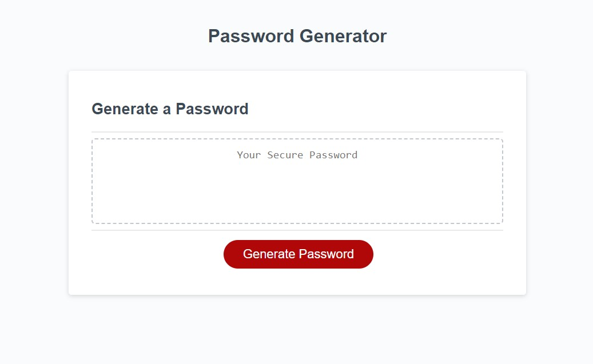
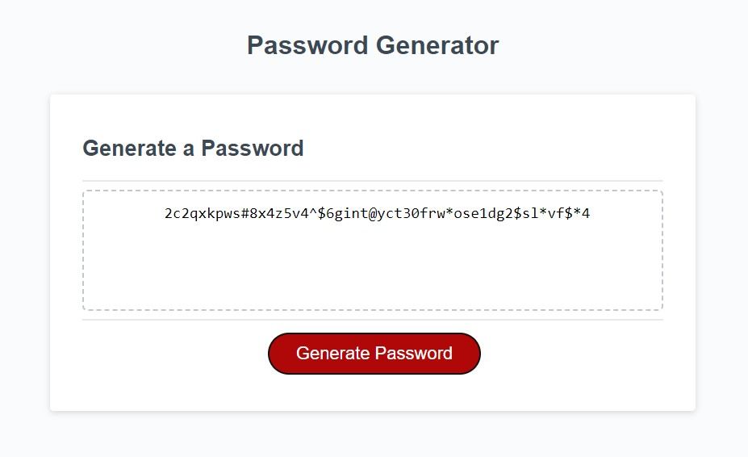
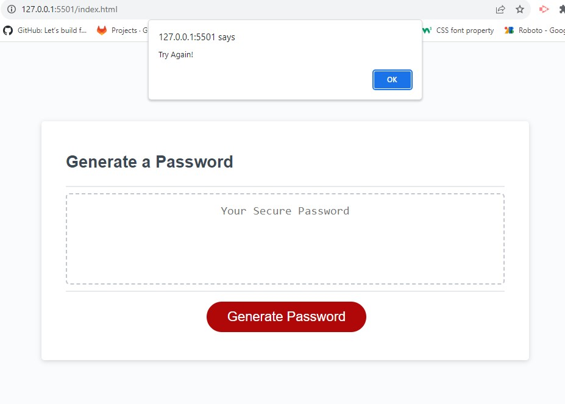

# Password Generator

## Description

This page is to generate a password of the indicated length using various symbols, numbers and characters of either upper case or lower case.

## Installation

N/A

## Usage

Upon entering the page please click the generate button and answer the questions to receive a random password of the desired length. If the user opts out of the password generation by clicking cancel or providing an incorrect answer in an attempt, then the user will get an alert to try again. 

## Credits

The content provided on my portfolio is a combination of resources. Partly my own, Louis Taylor, and partly the following resources: 

Study guide provided by "UCONN Coding Bootcamp": https://bootcamp.uconn.edu/coding/landing/?s=Google-Brand_Tier-1_&dki=Learn%20Coding%20and%20More%20Online&pkw=uconn%20coding%20bootcamp&pcrid=454903601490&pmt=e&utm_source=google&utm_medium=cpc&utm_campaign=GGL%7CUCON%7CSEM%7CCODING%7C-%7COFL%7CTIER-1%7CALL%7CBRD%7CEXACT%7CCore%7CBootcamp&utm_term=uconn%20coding%20bootcamp&s=google&k=uconn%20coding%20bootcamp&utm_adgroupid=104558016205&utm_locationphysicalms=9003215&utm_matchtype=e&utm_network=g&utm_device=c&utm_content=454903601490&utm_placement=&gad=1&gclid=CjwKCAjwhJukBhBPEiwAniIcNbFnq6Z3mXWoauKJK92QWiDfyasQQGNZcNtPk7xMkIAPc0pPM-pC_xoCkwUQAvD_BwE&gclsrc=aw.ds

VS Code: https://code.visualstudio.com/

The randomizer code came from and tailored to my code by: https://www.programiz.com/javascript/online-compiler/?ref=85f9cf89

## Quick Reference

https://louistaylor.github.io/Pw-gen

## License

Please refer to the LICENSE in the repo.
